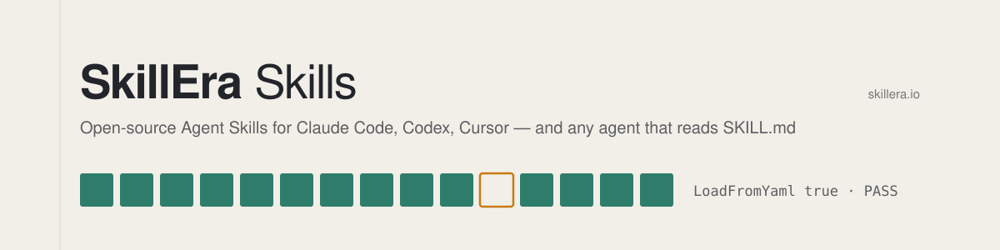

<picture>
  <source media="(prefers-color-scheme: dark)" srcset="assets/banner-dark.svg">
  
</picture>

[](https://github.com/KDavidP1987/power-platform-skill/actions/workflows/validate.yml)
[](.claude-plugin/plugin.json)
[](LICENSE)
[](https://kdavidp1987.github.io/power-platform-skill/evaluation.html)

# power-platform

**Power Platform development the way software is built, and proved in the product.**

Build Power Apps canvas apps, Dataverse solutions and Power Automate flows with the definition in
git, a portable artifact built from it, a deliberate deployment, and every change proved by
performing the task in the published app, driven by Playwright. A clean compile is not enough.

Version 0.27.1 · MIT · an [Agent Skill](https://agentskills.io) by [SkillEra](https://skillera.io) · [Changelog](CHANGELOG.md) · [Evaluation report](https://kdavidp1987.github.io/power-platform-skill/evaluation.html)

> [!NOTE]
> On ten realistic Power Platform tasks, run twice each, the same model passed **133 of 148** graded
> checks with this skill and **98 of 148** without it. The [evaluation report](https://kdavidp1987.github.io/power-platform-skill/evaluation.html)
> shows every check, what went wrong without the skill, and the limits of the measurement.

## Status: public beta (0.x)

The skill is usable today and is being hardened toward 1.0; see the [roadmap](ROADMAP.md).

- **Proven:** every bundled script has a `--selftest` that CI runs on each commit, with known-bad
  and fixed fixtures. The method has been used end to end on real apps: a canvas app, Dataverse
  schema and eight cloud flows built, imported, published and driven in the published player, with
  the flow loop and safe-recipient gates, a real `ship-canvas.py` export, pack and import, and a
  sent attachment checked byte for byte.
- **Guidance only:** advice that no script checks, such as which filters a list needs or how to word
  a guide. Snippets still marked "confirm in your tenant" in the references have not been through a
  real compile.
- **May change before 1.0:** script options and exit codes, finding codes, and the layout of
  `assets/`. Changes are recorded in the [changelog](CHANGELOG.md).
- **Issues:** open one at
  [github.com/KDavidP1987/power-platform-skill/issues](https://github.com/KDavidP1987/power-platform-skill/issues)
  with the symptom, what you expected, and the shortest reproduction. Leave out tenant, company and
  person identifiers.

## Road to 1.0

The backlog between this release and the [1.0 criteria](ROADMAP.md#10-the-criteria), in the order it
is being worked. It is kept in step with the [roadmap](ROADMAP.md#backlog-to-10) by
`scripts/sync-backlog.mjs`, and CI fails when the two differ.

<!-- backlog:start -->
| # | Item | Why it matters | Status |
|---|---|---|---|
| 1 | Power Pages: a site walk driver with sign-in, refusal and `/_api` proofs, and a reference covering row visibility, "my records", Private sign-in, deploy and teardown | The thinnest area: written from one real site, and nothing could walk a site or prove a refusal on one | First measured build (0.21): 30 of 30 blind checks, design 23 of 25, 85 minutes, no person needed. 0.22 adds Dataverse confirmation, captures and freshness waits to the walker, and the build's lessons (go-live decisions, identity for people who are not Dataverse users, the 15-minute cache window, feedback patterns). Second measured build (0.22): 30 of 30, design 23 of 25, 96 minutes (30 lost waiting on the site's sign-in consent), no person needed; it used the bundled walker for all 65 checks. 0.23 accepts the site's own consent when nobody is present, adds spill and covered-field checks to the walker, and stops asking a build with no seed to re-seed. Third measured build (0.23.1): 30 of 30, design 23 of 25, 90 minutes, no person needed. 0.24 turns what blind reviews kept finding into checks (current-page marker, focus contrast, double writes, unfilled columns, unguarded Global read), holds a site's hand-back for a critique of 30/40 and a five-topic security review, settles identity first with the administrator's steps, and ships in one call. 0.25 scopes every rule to the surface it serves (`rules-and-scope.md`): the 30/40 floor is for sites only, and the flow lint gates every import; 0.25.1 reads server logic in the permissions audit. 0.26 adds what a per-person visibility build taught: several relationships deciding visibility, server logic's read cache, and the site address and rename procedures. Microsoft's plugin arm is next |
| 2 | Speed and cost against Microsoft's plugins | The last four canvas builds beat them on quality but not on time or cost | 0.21: data-source check on `create`, a design-helper time box, no single-issue publishes after the fix batch; to be measured |
| 3 | A self-test in CI for every script, and a floor that refuses to pass when nothing was examined | A 1.0 criterion; four scripts had none | Done in 0.21. 0.27 extends the floor: a text check that measured none of its bound text exits 2, and one that measured under half warns |
| 4 | Teardown order for Fabric: Dataflows before their lakehouse | Dataflows can refuse deletion once their destination is gone | Done in 0.21 |
| 5 | Stabilise (0.9): one interface table, the compatibility file, upgrade notes | Users need options, exit codes and finding codes that stop moving | Interface table and compatibility file drafted in 0.21; freeze at 0.9 |
| 6 | Re-run the graded evaluation on the current version: ten or more task types (adding Power Pages, model-driven and SharePoint), three runs each, the held-out triggering set | A 1.0 criterion; the last graded run was 0.7.1 (217/222 with the skill, 136/222 without) and much has changed since | Open |
| 7 | Publish the 0.7.x results and the measured builds on the evaluation page | The page still shows the 0.5.1 run | Open |
| 8 | A model-driven app with a responsive canvas companion, built and verified in a tenant | Clears most of the snippets still marked "confirm in your tenant" | Open |
| 9 | SharePoint as a data source: delegation, the 5,000-item threshold, staying on a standard licence | Common in real tenants; written down nowhere yet | Open |
| 10 | Approvals in Teams and Outlook, and the one-Approvals-connection-per-person limit | Every approval flow meets it | Open |
| 11 | Two independent real builds in different tenants | A 1.0 criterion; every build so far ran in one tenant | Open: needs a second tenant |
<!-- backlog:end -->

## Contents

1. [Status: public beta (0.x)](#status-public-beta-0x)
1. [Road to 1.0](#road-to-10)
1. [Why this skill exists](#why-this-skill-exists)
2. [What you get](#what-you-get)
3. [Install](#install)
4. [Quick start](#quick-start)
5. [The working loop](#the-working-loop)
6. [Playwright: the published app is the test harness](#playwright-the-published-app-is-the-test-harness)
7. [Bundled tools](#bundled-tools)
8. [Hooks](#hooks)
9. [Reference library](#reference-library)
10. [Rules the skill will not bend](#rules-the-skill-will-not-bend)
11. [Evaluation](#evaluation)
12. [Limits of this version](#limits-of-this-version)
13. [Repository layout](#repository-layout)
14. [Versioning and changes](#versioning-and-changes)
15. [Contributing](#contributing)
16. [License](#license)

## Why this skill exists

Power Platform has an unusual property: **almost every failure is silent.**

| What you see | What actually happened |
|---|---|
| `pac solution pack` exits 0 | A component was dropped from the zip |
| The canvas compile passes | It validated against no data sources at all |
| The import reports success | It imported whatever zip it was handed, including the wrong one |
| A flow saves and turns on | It listens to the wrong event, or re-triggers itself on its own write |
| A button does nothing | One failing step abandoned the rest of the formula without a message |
| It works in Studio Preview | The published app resolves against a cached copy of your table metadata that no longer matches Dataverse |

A change can compile clean, work in Preview, pass every audit, and do nothing for every user. This
skill is a working method built from those failures. Every trap it describes comes with its
**signature**, so a symptom is recognised in minutes instead of days, and every step of shipping
states **what it proves and what it does not**.

## What you get

| Part | What it is |
|---|---|
| **The method** | `SKILL.md`: ten non-negotiables, a ten-step working loop, and a routing table into the references. Loaded whenever a task touches Power Apps, Power Automate, Dataverse or a solution. |
| **21 references** | Self-contained guides loaded only when a task needs them: canvas shipping, manifest caches, Power Fx and `.pa.yaml`, controls, layout, browser verification, Dataverse, the Web API, security, data migration, flows, reporting (in-app and Power BI), CI/CD pipelines, audits, project setup and more. |
| **Six tools** | A Dataverse schema deployer, a ship pipeline, a metadata drift checker, an artifact inspector, a cloud-flow linter, and a Playwright driver for Studio and the published player. Each proves it can fail with `--selftest`. |
| **Hooks** | Plugin gates that hold a new build to its order (plan before schema, design before screens, critique and review before hand-back) with no setup, plus project hooks that stop known compile-killers at the moment a file is written, a session pre-flight and an end-of-turn audit. |
| **Templates** | Hook settings, config examples, an example browser scenario, and state, decisions and dependency templates. |

## Install

**Any agent that reads `SKILL.md`** (Claude Code, Codex, Cursor and others):

```bash
npx skills add KDavidP1987/power-platform-skill
```

**Claude Code plugin marketplace:**

```text
/plugin marketplace add KDavidP1987/power-platform-skill
/plugin install power-platform@power-platform-skill
```

**Manually:** copy `skills/power-platform/` to `~/.claude/skills/power-platform/`, or to the
equivalent skills folder for your agent.

**Updating.** Plugin: `/plugin marketplace update power-platform-skill`, or turn on auto-update for
the marketplace in `/plugin`. `npx skills`: run the same `add` command again. Manual copy: replace the
folder. Then re-run `setup-harness.mjs` (plan first) in each project so its hooks and tools match.
Projects with the harness installed are told at session start, at most once a day, when a newer
release exists.

**Something wrong, or a lesson to add?** Open an issue with the defect or lesson template.

### Requirements

The method and references need nothing installed. The tools need:

| Need | For | Notes |
|---|---|---|
| **Node 20+** | Hooks, flow linter, browser driver | No npm dependencies for the hooks or the linter |
| **Python 3** | `ship-canvas.py`, `inspect-artifact.py`, `check-drift.py`, `deploy-tables.py`, `canvas-mcp.py`, `flow-runs.py`, `audit-pages-permissions.py`, `check-published-order.py`, `seed-data.py`, `deploy-flows.py`, `fabric.py`, `reconcile-report.py`, `pbi-theme.py` | Standard library only |
| **.NET 10 SDK** | The canvas authoring server (`canvas-mcp.py`) | Started with `dnx`; nothing else to install |
| **PowerShell** (optional) | `dv-token.ps1`, owner scripts | Windows PowerShell 5.1 or PowerShell 7 |
| **Power Platform CLI** (`pac`) | Packing, importing, environment checks | `pac org who` is part of every pre-flight |
| **Playwright** (optional) | Browser verification | `npm i -D playwright`; drives the Chrome or Edge you already have. See [below](#if-playwright-is-not-installed) |
| **Playwright MCP server** (optional) | Interactive browser investigation | Used when present; not required |

## Quick start

1. **Install the skill** (above) and open your Power Platform repository in your agent.
2. **Ask for real work.** The skill loads on its own for Power Platform tasks, for example:
   - *"The Save button works in Studio but does nothing in the published app. Why?"*
   - *"Add a vendor picker to `src/Screens/scrOrders.pa.yaml` over a 3,500-row Dataverse table."*
   - *"Write the solution flow JSON that locks a request row after it is submitted."*
   - *"Set up this repo for canvas app and Dataverse work: layout, hooks, ship checks."*
3. **Install the harness** (optional, recommended; the agent offers it). From the project folder:
   `node <skill>/scripts/setup-harness.mjs .` shows the plan and `--apply` installs the hooks (wired
   into `.claude/settings.json`, existing entries kept), the tools under `scripts/`, the config and
   the continuity documents. Re-run it after updating the skill; the session pre-flight tells you
   when a newer release exists.
4. **Describe your app once** for the browser driver. Copy
   `assets/canvas-app.example.json` to `scripts/canvas-app.json` and fill in the environment id and
   URL, app id, app name, and a command that prints a Dataverse token. Nothing about your app is ever
   written into the tools themselves. Starting on a new machine or a new environment?
   [`first-run.md`](skills/power-platform/references/first-run.md) is the order to set everything up
   in, with a smoke test to run before the first change.
5. **Verify in the product.** After a change ships, have the agent run a scenario against the
   published app (`canvas-browser.mjs walk`), as the role that will use it, and confirm the effect
   in Dataverse.

## The working loop

Every non-trivial change moves through the same cycle. Each step proves one thing, and skipping one
is how a change reaches users unproven.

| # | Step | What it proves |
|---|---|---|
| 1 | **Pre-flight**: branch, clean tree, `pac org who`, read the state file | You are changing the right thing in the right environment |
| 2 | **Specify**: who uses it, what proves it, what it touches | There is a test before there is a change |
| 3 | **Build in source**: `.pa.yaml`, solution XML, flow JSON; hooks check each write | The known compile-killers are absent |
| 4 | **Audit**: a stale input is unverified, not a pass | Project rules hold on current inputs |
| 5 | **Compile against a live Studio session**, and read the first line of the result | Formulas bind to real data sources |
| 6 | **Build on the live manifest and assert on the artifact** | The zip contains every component and marker you changed |
| 7 | **Import, then confirm what landed**: `LoadFromYaml`, markers in the half that runs, data-source count | The environment runs what you built |
| 8 | **Perform the task in the published app**: fresh build, right role, effect checked in the database, data restored | The feature works for the person who uses it |
| 9 | **Document in the same change** | The next session starts from the truth |
| 10 | **Refresh the audit inputs** | The next audit describes the app that now exists |

The full table of what each step does *not* prove, and the two ship paths (solution import and
co-authoring push), are in [`references/canvas-shipping.md`](skills/power-platform/references/canvas-shipping.md).

## Playwright: the published app is the test harness

A canvas app has no test framework. Opening Studio, adding a data source, capturing a network trace
and running the app all used to be "needs a person". All of them are browser work, and a browser
can be driven. Verifying in the published app is the standard here, not a fallback.

### Two ways to drive the browser

| | Playwright MCP tools | Bundled `canvas-browser.mjs` |
|---|---|---|
| **Best for** | Looking: an investigation, a one-off check, finding a selector | Anything repeatable: post-ship verification, regression scenarios, sweeps |
| **Form** | Step-by-step tool calls in the session | JSON scenarios, reviewable and re-runnable |
| **Needs** | The MCP server attached to the session | `npm i -D playwright` in the repo |
| **When the other is missing** | | Works when the MCP server did not attach, which happens |

### What the skill asks the agent to do

- **Prefer the published player to Studio Preview.** Preview runs live metadata; users run the
  published app and its cached copy.
- **Clear the stale player first.** The player serves a cached build from IndexedDB behind a
  late-arriving banner; `play --fresh` and `walk --fresh` clear it and the scenario asserts the
  build stamp.
- **Perform the task as the role that uses it.** An admin session proves nothing about a
  restriction. If only an admin account is available, the result is reported as unverified.
- **Confirm the effect where it lands.** Read the row back through the Web API, not the screen that
  wrote it.
- **Restore what it wrote.** A scenario that writes must declare `"writes": true` and a `"restore"`;
  the driver refuses to run it without `--allow-writes`.

### If Playwright is not installed

The skill never installs anything silently. When neither the MCP tools nor the Playwright library
is available, the agent:

1. **Says so:** the change is **unverified**, not passed.
2. **Asks before installing**, offering the lightest option first:

   ```bash
   npm i -D playwright                 # drives the Chrome or Edge already on the machine
   npx playwright install chromium     # only if neither is installed; then use --channel chromium
   claude mcp add playwright -- npx @playwright/mcp@latest   # optional: interactive browser tools
   ```

3. **Keeps going with what needs no browser:** scenario `lint`, every `--selftest`,
   `inspect-artifact.py` on the solution or `.msapp`, the flow linter and the hooks.
4. **Hands over the manual check:** the exact steps to perform in the published app and the Web API
   query that confirms the effect.

The driver itself loads Playwright lazily, so `lint` and `--selftest` run without it. When a
browser command cannot run it prints the install options above and exits with code **8**: nothing
was verified. Use `--channel chrome`, `msedge` or `chromium` to choose the browser.

### A scenario

```json
{
  "name": "approve-request",
  "build": "Build 2026-01-01 12:00 abc1234",
  "writes": true,
  "restore": "revert-approve-request",
  "confirm": [
    { "entitySet": "app_requests", "filter": "app_number eq 'REQ-0042'",
      "expect": { "app_status": "Denied" }, "count": 1 }
  ],
  "steps": [
    { "click": "Approvals", "settle": 5000 },
    { "type": "REQ-0042", "into": "Search" },
    { "click": "Open", "nth": 0 },
    { "type": "Missing cost centre", "into": "Reason" },
    { "click": "Deny", "settle": 6000 },
    { "expect": "Denied" },
    { "deadclick": "request-detail" }
  ]
}
```

The driver knows what makes naive automation lie:
- The app lives in an iframe.
- A TextInput commits on blur, so typed text is not entered until focus leaves.
- A DropDown has no accessible name.
- A gallery keeps every row in the DOM.
- Studio's Save must be clicked, not keyed, and is proved by the "Saved:" time moving.
- Studio must be left through Back, or the edit lock is stranded.
- A `Notify()` banner is drawn outside the app's frame.
- "Saved" on screen proves nothing about the row: `confirm` reads it back from Dataverse after the
  steps, and a row that did not change during this run fails.

## Bundled tools

All tools live in `skills/power-platform/scripts/`. Every checker carries a `--selftest` that
proves it goes red on a known-bad input, and CI runs them on every push.

### `canvas-browser.mjs`: Playwright driver

| Command | Does |
|---|---|
| `login` / `check` | Sign in once (headed, MFA included) / confirm the saved profile is still signed in |
| `play [--fresh]` | Open the published app, capture it, and report console errors |
| `walk <scenario.json> [--fresh] [--trace]` | Perform a task and assert the result |
| `studio` / `keys` | Open Studio in edit mode and hold it / reattach and send keys |
| `save` / `publish [--reload-first]` / `close-studio` | Save with proof, publish, and leave through Back to free the lock |
| `shot <url> <name>` | Screenshot plus accessibility dump of any page |
| `doctor [--record]` | Check every UI anchor in `assets/selectors.json` against a live session: `0` all resolve, `9` stale, `2` cannot verify |
| `lint <scenario.json>` | Check a scenario's verbs without a browser |
| `confirm <scenario.json> [--since ISO]` | Run only the scenario's Dataverse checks, no browser |

Scenario verbs: `click`, `type`, `select`, `fillCell`, `expect`, `absent`, `scroll`, `clipcheck`,
`deadclick`, `overlapcheck`, `measurefont`, `capture`. `--trace` records which tables each `$batch`
touched, and the failures hidden inside a 200 response.

### `ship-canvas.py`: the ship pipeline

Builds an importable solution from repo source on top of the **live** app, in nine steps that each
print what they prove: pre-flight, live baseline (`pac` export and download, or `--live`), unpack,
live metadata, cache reconciliation (choice members in both caches, lookup navigation names, entity
set names; a second pass must change nothing), stamp and pack, build the solution (roles stripped,
player data-source list repaired, version bumped), assertions on the finished zip, and import.

```bash
python ship-canvas.py --dry-run                  # every step, nothing written, no pac command run
python ship-canvas.py                            # build and assert; a refused zip is renamed .refused
python ship-canvas.py --import [--publish]       # only with these flags: pac org who, rollback export, import
```

Reads `scripts/canvas-app.json`. Exit codes: `0` built, `1` refused, `2` could not run.

### `check-drift.py`: is the app's cached metadata stale?

"Works in Studio, fails in the published app" in one command. Reads the metadata a canvas app froze
into its manifest and compares it, **read-only**, with live Dataverse or with a saved dump: tables,
entity set names in every cached copy, columns the formulas use, column types, choice members in
both caches, lookup navigation names, and the player's data-source list. Each finding states what
breaks in the published app and the fix.

```bash
python check-drift.py out/app.msapp --org https://<org>.crm.dynamics.com   # GET requests only
python check-drift.py out/app.msapp --org ... --dump metadata.json         # save live metadata
python check-drift.py out/app.msapp --offline metadata.json                # in CI, no tenant
```

Exit codes: `0` clean, `1` drift, `2` could not verify, which is never a pass.

### `deploy-tables.py`: Dataverse schema from a manifest

Creates the publisher, solution, tables, columns, choice options and lookups described in a JSON
manifest (the shape, with every column type, is in `skills/power-platform/assets/tables.example.json`),
publishes, turns every table owned by another solution that a lookup pulled in with its schema back
into a reference, and then reads every table, column, option and lookup back from the environment.
It only adds: a re-run is a no-op, nothing is renamed, retyped or deleted, choice options are
append-only, and a column that exists with another type stops the run before any write. A manifest
error (unknown type, missing prefix, duplicate names, a mixed-case lookup) is refused before any call.
Security roles are deliberately not part of it.

```bash
python deploy-tables.py --manifest tables.json --org https://<org>.crm.dynamics.com --plan   # GET only
python deploy-tables.py --manifest tables.json --org https://<org>.crm.dynamics.com          # apply, then read back
```

Exit codes: `0` deployed and read back, `1` a conflict or something missing on read-back, `2` a
manifest error or a run that could not complete, which is never a pass.

### `site-walk.mjs`: a Power Pages site walked as a signed-in person

`signin` opens a headed browser once so the person signs in with Entra ID; `walk` then drives the
live site from a JSON scenario at 1440 and 390 px: pages, steps and expected text, a sideways-scroll
check on every page, and page-only screenshots. Its refusal probes run inside the signed-in page and
call the site's own `/_api` with the anti-forgery token, so they test what a person could really do:
a hidden row by id or filter, another person's row, a PATCH, a DELETE, a forbidden create. Signed-out
checks run in a fresh context and fail on any data shown. A writing walk must carry `confirm` checks
that read the rows back over the Dataverse Web API and prove they changed during the run; `capture`
carries a value (a new key, an id) into later steps, and `expectWithin` waits for a cached page and
records how long it took. Example in
`assets/scenarios/site-walk.example.json`. Exit codes: `0` clean, `1` findings (`SW-SCROLL`,
`SW-API-ALLOWED`, `SW-SIGNEDOUT-LEAK` and others in `references/interfaces.md`), `2` nothing
examined.

### `inspect-artifact.py`: what a solution zip or `.msapp` really contains

Root components against built metadata, security roles, workflows, `LoadFromYaml`, the build
stamp, data-source counts, `DatabaseReferences` against `DataSources.json`, and markers searched
in the half of the app that runs. Exit codes: `0` as expected, `1` a check failed, `2` the
artifact could not be read.

### `check-canvas-format.mjs`: long text and theme tokens

The formatting a compile never checks. **Long text:** for every text control whose `Text` reads
data, it works out the widest value the expression can produce and the room the box has, and fails
when the text can overflow with no remedy. Lengths come from a schema generated from Dataverse
metadata (`MaxLength`, choice labels, number ranges), per table, with overrides for limits the app
enforces; collections are measured from the formulas that build them. Remedies it accepts: clamp
with an ellipsis plus a tooltip that reads the same columns, a flexible-height row with `AutoHeight`,
an `OnSelect` detail view, a scrolling detail pane outside a gallery, or (one-line cells) `Wrap` off
with a tooltip that reads the same columns. **Vertical fit:** a box shorter than one line of its
font, or a one-line box whose data can wrap, shows text cut at the top and the bottom. **Theme tokens:** once the
app defines its colours and fonts in `App.pa.yaml`, a literal colour or font in a screen fails.
**Format strings:** a `%` in a `Text()` mask (it does not multiply by 100) and a decimal part of
only `#` (`"0.##"` shows "110.") fail in every file, `App.pa.yaml` included.

```bash
node check-canvas-format.mjs canvas/<app>/Src --schema canvas/text-fit-schema.json
node check-canvas-format.mjs canvas/<app>/Src --char-em 0.58      # calibrated from measurefont
echo '{"tool_input":{"file_path":"canvas/app/Src/Home.pa.yaml"}}' | node check-canvas-format.mjs --hook
```

| Check | Catches |
|---|---|
| `text-overflow` | Data-bound text that can exceed its box (rows x width, at its size and weight) |
| `text-cut-vertically` | A box shorter than one line of its font (Size is points; a line is about 1.15 x Size x 4/3 px) |
| `one-line-box-wraps` | A one-line box with `Wrap` on, no tooltip, holding data that can exceed its width |
| `literal-text-overflow` | A literal caption or paragraph with more lines than its box holds |
| `autoheight-in-fixed-row` | `AutoHeight` in a fixed-height gallery, where the row still clips |
| `clamped-without-full-text` | Text cut with `Left()` and no tooltip reading the same columns, nor an `OnSelect` |
| `scroll-in-gallery-row` | `Overflow.Scroll` inside a gallery row |
| `literal-colour`, `literal-font` | A literal `RGBA()`, `ColorValue()`, `Color.<Name>`, hex or `Font.<Name>` in a screen (an error once theme tokens exist) |
| `list-without-filter` | Advisory warning: a table gallery whose Items reads no filter, search or grouping control. Never changes the exit code |

Every run prints how many controls it examined, read data and could measure. Exit codes: `0` clean,
`1` findings, `2` nothing examined or none of the bound text measurable, which is not a pass; under
half measured prints a loud warning. The room is an estimate that errs toward
"does not fit"; `canvas-browser.mjs clipcheck` is the authority in the running app.

### `check-canvas-overlap.mjs`: controls drawn over other controls

The commonest layout defect in an agent-built app: a new button or label placed where another
control already sits, and the other control shows only under some condition - a warning, an empty
state, a tab, a role. With the condition off, every screenshot looks right. This reads the source,
so it sees every state at once: each pair of text-bearing or interactive controls in the same
coordinate space whose boxes overlap, unless their `Visible` conditions (and their ancestors') are
provably exclusive.

```bash
node check-canvas-overlap.mjs canvas/<app>/Src
node check-canvas-overlap.mjs canvas/<app>/Src --explain     # also list every exempted pair
echo '{"tool_input":{"file_path":"canvas/app/Src/Home.pa.yaml"}}' | node check-canvas-overlap.mjs --hook
```

| Check | Catches |
|---|---|
| `overlap` | Two text-bearing or interactive controls that can be on screen together and overlap; names which is on top, both conditions, and the `If` branch of the layout it happens in |
| `covers-control` | A Rectangle, Image or non-clickable Icon declared after a button and covering its centre: the click does nothing |
| `hidden-under` | Decoration declared after a label or gallery and covering it: the text never shows |
| `off-canvas`, `outside-row` | Warnings: past the design surface, or past the gallery row that clips it |

Exclusive means provable: the same name against different literals, `A` against `!A`,
`A || B` against `!A && !B`, `x > 0` against `x = 0`, `x = y` against `x <> y`, `in` lists. A
modal over its full-surface backdrop, an empty-state label over its own gallery, a text-less click
pad over a tile and a results list whose `Visible` reads its input are exempt. Every run prints how
many controls it resolved and why it skipped the rest; exit `2` when it resolved none.

### `lint-flows.mjs`: static checks on cloud-flow definitions

| Check | Catches |
|---|---|
| `runtime-invoker` | A non-app trigger running connections as the invoker |
| `trigger-message-mismatch` | The SDK message code does not match the event described |
| `self-trigger-loop` | A flow writing its own trigger table where no path condition is false after the write. The expressions are parsed, not matched by name, following one level of Compose and variable indirection |
| `self-write-guard-assumes-value` | A guard that holds only if a value read at run time is never blank |
| `apostrophe-in-literal` | An apostrophe that ends an expression string early |
| `not-on-runafter-path` | A reference to an action that may not have run |
| `send-after-failed` | A notification chained to run after another one failed |
| `at-property-name` | A single `@` property name the runtime reads as an expression |
| `multiple-triggers` | More than one trigger in one definition |
| `date-only-as-instant` | A date-only column used as a point in time (`--date-only`) |
| `unknown-entity-set` | An entity set name that does not exist (`--entity-sets`) |
| `update-trigger-unfiltered` | A Dataverse Update trigger with no `filteringattributes`, which starts on any write to the row |
| `trigger-cycle` | Any cycle of "this write starts that flow" across all the flows, including two flows on one table and a Create-triggered flow creating its own rows. An edge counts unless the target's trigger condition is false for every value the write can land |
| `alternating-rearm` | One write that can land two values which each start a flow, such as a retry sweep flipping between two re-arming states |
| `unsafe-recipient`, `unsafe-http` | With `--require-safe-recipients`: a recipient that is not a `Safe_to_` Compose whose test branch can only be the allowlist, or any HTTP action |

The loop rules are a hard gate: run the linter over all the solution's flows at once (a cycle
through two flows is invisible one file at a time), and import only on exit 0. `--verbose` prints
the trigger graph's surviving edges.

Exit codes: `0` clean, `1` findings, `2` no flow definitions found, which is not a pass.
Activation is still the only real compile: turn each flow on once before trusting it.

### The documentation set (`assets/doc-kit/`)

Once an app works, the skill offers four guides generated from the app and its environment: one per
user role, one for managers, one for administrators, and an extensive developer and platform guide.
The structure and writing rules are in `references/documentation-set.md`.

```bash
python skills/power-platform/assets/doc-kit/doc_kit.py --selftest
python doc_kit.py trim out/shots out/shots-trimmed      # remove player chrome from captures
python doc_kit.py inventory shots.json                  # every required screen x role has a figure
python build-guides.py --draft                          # copied from build_guides_example.py
```

Guides take the app's own theme colours from `canvas/theme.json`. Output goes to `out/`, which is
git-ignored, because screenshots carry names.

### Keeping up with Microsoft's changes

Studio, the published player and the maker portal change without notice. Every selector and text
anchor the driver uses lives in one table, `skills/power-platform/assets/selectors.json`, with a
`lastVerified` field per entry. To check them against your tenant:

```bash
node skills/power-platform/scripts/canvas-browser.mjs login
node skills/power-platform/scripts/canvas-browser.mjs doctor      # 0 all resolve, 9 stale, 2 cannot verify
```

`doctor` opens the published app and Studio in edit mode, then leaves through Back. It never saves
or publishes. Offline, signed out, or against an app that does not load, it reports that it cannot
verify instead of passing.

A scheduled workflow (`.github/workflows/upkeep.yml`) runs every bundled self-test each month and
compares the Playwright and Playwright MCP versions with `assets/tested-versions.json`. When
anything moved or failed, it opens one `upkeep` issue with a re-verification checklist. It holds no
tenant secrets; the live check stays a manual step.

## Hooks

**Plugin gates** (`hooks/hooks.json`, active whenever the plugin is enabled, silent outside a Power
Platform build, `"pluginGate": false` in `scripts/canvas-app.json` turns them off):

| Gate | Event | Does |
|---|---|---|
| `plugin-gate.mjs --pre` | PreToolUse | Refuses a new app's screen `.pa.yaml` (file tool or shell write) until `DESIGN.md` and `design/prototype.html` exist, and `deploy-tables.py` (not `--plan`) until a filled acceptance contract (or a DOD plan, when the person chose DOD) exists. An established app (three or more screens) is not held up |
| `plugin-gate.mjs --post` | PostToolUse | After shell calls in a Power Platform build, reports the budget with numbers: the shell-call count every 40 calls (with the batched tools to use), and the elapsed time at 45, 60, 90 and 120 minutes against the one-hour budget. Never blocks |
| `check-pa-yaml.mjs --plugin` | PostToolUse | The compile-killer check below on every `.pa.yaml` write, where the session's folder has no project harness to run it (a session opened at a parent of several projects). Stands down where the harness copy exists |
| `plugin-gate.mjs` | Stop | Blocks the hand-back while the design, prototype, screenshot critique or reviewer's record is missing, or a token is written to a file or lakehouse; and, read from the session transcript, while background shell work this session started is still running, while a walk wrote production data after the last clean seed check (or that check found drift), or when no person is present (a headless run) and the last message asks the person a question. Up to three times per session and kind, then lets the stop through with the gaps on stderr |

**Project hooks**: copy `skills/power-platform/scripts/hooks/` to `.claude/hooks/` and merge
`assets/settings.snippet.json` into `.claude/settings.json`.

| Hook | Event | Does |
|---|---|---|
| `preflight.mjs` | SessionStart | Git state, `pac org who`, the top of `docs/STATE.md`, the ship loop in one line |
| `check-pa-yaml.mjs` | PostToolUse | Colon-space in single-line Power Fx (`--fix` moves it into a block scalar), a `#` line inside a formula or ` #` in a single-line value, `Tooltip` on a modern Button, `AccessibleLabel` on a classic Label, shallow block-scalar lines, the file ceiling: faults that fail a whole-app compile. Also blocks an aggregate compared with `= 0`/`<> 0` without `Coalesce`; notes, without blocking, a Yes/No column read through `Coalesce(..., false)` and two queued `Select()` calls |
| `check-standards.mjs` | PostToolUse | Optional, configurable output standards (by default emoji and purple accents, Power Fx `RGBA` included) |
| `check-canvas-format.mjs --hook` | PostToolUse | Long data-bound text with no remedy, and literal colours or fonts once theme tokens exist; blocks only on lengths it knows (`textFitSchema` in `standards.config.json`) |
| `check-canvas-overlap.mjs --hook` | PostToolUse | A control placed over another that can be on screen at the same time, or decoration declared over a button or label; blocks on errors in the file just written |
| `audit-stop.mjs` | Stop | Repo-wide standards, leftover debug markers, file ceiling, bookkeeping reminders; blocks once, never loops |

Hooks flag only what is known to break, never style: a hook that fires on style gets switched off.
Configure them with `.claude/hooks/standards.config.json` (example in `assets/`).

## Reference library

`SKILL.md` routes each task to one reference. Each topic has one home; where another reference
touches it, it points there rather than repeating it.

| Area | Reference | Covers |
|---|---|---|
| Whole build | [`orchestration`](skills/power-platform/references/orchestration.md) | Schema and sample data first, then canvas, flows and reporting in parallel helper agents (one per screen); the lane contract and lock owners; cost discipline; decisions-only for the person; browser hygiene; one verify-fix-confirm round |
| Canvas | [`canvas-shipping`](skills/power-platform/references/canvas-shipping.md) | The ship loop and what each step proves; solution import vs co-authoring push; build stamps; `LoadFromYaml`; Save vs Publish |
| | [`authoring-sessions`](skills/power-platform/references/authoring-sessions.md) | Studio edit locks, the authoring MCP server, what a live session can and cannot prove |
| | [`manifest-caches`](skills/power-platform/references/manifest-caches.md) | Why the published app disagrees with Dataverse: cached choice members, column types, entity set names, column lists |
| | [`power-fx-and-pa-yaml`](skills/power-platform/references/power-fx-and-pa-yaml.md) | Silent formula abandonment, `App.OnStart` races, choice and Yes/No types, delegation and the row limit, "no parent" (blank-lookup) filters that stay delegable, `.pa.yaml` syntax that fails the compile |
| | [`canvas-controls-and-patterns`](skills/power-platform/references/canvas-controls-and-patterns.md) | TextInput, ComboBox, DropDown, gallery and timer behaviour; one picker for "All", "None" and real records; read models; save handlers, concurrency and partial failure |
| | [`canvas-layout`](skills/power-platform/references/canvas-layout.md) | Responsive screens (computed geometry or auto-layout containers, verified at three widths), measured text width, wrap and clipping, galleries, z-order, unclickable controls, geometry audits, accessibility and contrast |
| | [`browser-verification`](skills/power-platform/references/browser-verification.md) | Playwright against Studio and the player, the stale player cache, proving a save or publish, scenario design, negative tests, the acceptance contract that turns a request into walks |
| Power Pages | [`power-pages`](skills/power-platform/references/power-pages.md) | Choosing the app type by audience and licence; a site in git with hand-written records; table permissions plus the Web API column allow-list; Append and Append To on both sides of a lookup; Private-site sign-in, consent and claims; Liquid reads and Web API writes; the site cache; classic or code site; rows only some people may see; "my records"; Web API settings and refusal codes; Private-site access and the trial; the site lifecycle without the Azure CLI; teardown; proving the refusals with `site-walk.mjs`; designing the site in the organisation's identity (with the impeccable design skill), with phone-first forms |
| Dataverse | [`dataverse`](skills/power-platform/references/dataverse.md) | Solution shape, asserting on the artifact, schema hygiene, attribute types and table shapes (a team of one, membership with allocation), connection references, safe data writes |
| | [`dataverse-web-api`](skills/power-platform/references/dataverse-web-api.md) | Tokens, names, idempotent provisioning, eventual consistency, choice members, alternate keys, dependency checks, paging |
| | [`security-and-access`](skills/power-platform/references/security-and-access.md) | Roles kept out of the solution, roles as code, impersonation, sharing, column security, onboarding |
| | [`data-migration`](skills/power-platform/references/data-migration.md) | Profiling, crosswalk keys, spreadsheet loads, backfills on watched tables, read models, cut-over |
| | [`documentation-set`](skills/power-platform/references/documentation-set.md) | The documentation set for a finished app: user, manager, administrator and developer guides, screenshots per role, the doc kit |
| | [`model-driven-and-docs`](skills/power-platform/references/model-driven-and-docs.md) | Model-driven apps (when they fit, the schema and shared-table rules, Microsoft's app builder, browser verification), forms by script, guides generated from the running product, licensing as a dependency |
| Power Automate | [`power-automate`](skills/power-platform/references/power-automate.md) | Solution flow JSON, `runtimeSource`, SDK message codes, trigger loops and sentinel guards, activation as the only compile, notification safety, diagnosing a failed run |
| Reporting | [`reporting`](skills/power-platform/references/reporting.md) | History first (an append-only event table, baseline, labelled demo history, commitment fields); a change log for plan-vs-actual variance, planned against unplanned; in-app charts from galleries and their compile traps; metric definitions (burn-down, burn-up, velocity, say/do, throughput, cycle time, aging, flow, mix); Power BI over a Fabric medallion, embedded in the app or linked with a filter; viewer licensing |
| Process | [`audits`](skills/power-platform/references/audits.md) | Proving a check can fail, floors against vacuous passes, stale-input detection, comparing the published app with the repo, the audits worth having |
| | [`project-setup`](skills/power-platform/references/project-setup.md) | Repository layout, bootstrapping with `pac`, the harness (hooks, tools, config and docs installed by `setup-harness.mjs`), generated screens, owner scripts, continuity documents |
| | [`shared-environments`](skills/power-platform/references/shared-environments.md) | Several apps in one environment: ownership, shared tables, change protocol |
| | [`alm-pipelines`](skills/power-platform/references/alm-pipelines.md) | CI/CD with `pac` in GitHub Actions and Azure DevOps: service principals, Solution Checker, managed vs unmanaged, deployment settings, activating flows, the skill's tools as gates. Each statement marked documented, observed or untested |
| | [`first-run`](skills/power-platform/references/first-run.md) | From nothing to a working agent: rights, machine, pac, a self-renewing token, a browser that signs in by itself, Studio, the app config, the hand-back pattern, the smoke test, every identity signed in once |
| | [`tooling-and-auth`](skills/power-platform/references/tooling-and-auth.md) | `pac`, tokens, the TDS endpoint, MCP servers, Windows and PowerShell traps |
| | [`interfaces`](skills/power-platform/references/interfaces.md) | Every script's options, exit codes and finding codes in one table, and upgrade notes from earlier 0.x releases (the 0.9 interface freeze candidate) |

## Rules the skill will not bend

- **The repo is the source of truth.** Studio is never the last place a change was made.
- **Assert on the finished artifact, never on an exit code.**
- **Verify by performing the task in the published app, as the role that uses it.** An admin
  session proves nothing about a restriction; the skill says "unverified" rather than imply it.
- **Verify the effect where it lands:** in the table, not on the screen that wrote it.
- **Schema before screens, and never in one step.**
- **Security roles stay out of the solution.**
- **A flow that writes its own trigger table guards on a value that write changes.**
- **Before any bulk write, count the messages and park the sender.**
- **An audit that can pass vacuously will:** floors, self-tests, stale-input detection.

## Evaluation

Measured on version 0.7.0 with three runs per configuration; the three canvas tasks (search and
picker, long text, list filters) were re-run on 0.7.1. The same model and prompt ran with the skill
and without it, in fresh sessions, graded against checks fixed before the runs: by the bundled
checkers where they apply, otherwise by a grader that did not know which configuration it was reading.

| Test | With the skill | Without |
|---|---|---|
| A Submit button that does nothing after a three-part release | **8/8, 8/8, 8/8** | 3/8, 2/8, 2/8 |
| A cloud flow that writes to its own trigger table | **9/9, 9/9, 9/9** | 8/9, 5/9, 8/9 |
| A Playwright check of an approval, confirmed in Dataverse | **7/8, 8/8, 8/8** | 3/8, 4/8, 3/8 |
| Search and a 3,500-row picker in a `.pa.yaml` screen | **9/9, 9/9, 7/9** | 2/9, 3/9, 2/9 |
| Three of five cloud flows that start each other | **6/7, 7/7, 7/7** | 5/7, 6/7, 6/7 |
| A recipient leak in an existing flow | **6/6, 6/6, 6/6** | 6/6, 4/6, 6/6 |
| Long text clipped in a gallery | **5/6, 6/6, 6/6** | 4/6, 3/6, 4/6 |
| A list screen nobody asked to filter | **7/7, 7/7, 7/7** | 5/7, 6/7, 5/7 |
| Theme intake before the first screen | **7/7, 7/7, 7/7** | 5/7, 5/7, 5/7 |
| The documentation set for a handover | **7/7, 7/7, 7/7** | 5/7, 5/7, 6/7 |
| **Total** | **217/222 (98%)** | **136/222 (61%)** |

The loop and recipient tasks were rewritten for 0.7.0 to be harder: a cycle hidden among five flows
with a one-day drift, and a leak inside one branch of an existing flow. On 0.7.0 one check failed in
every run of both configurations: the agent wrote `.pa.yaml` that does not compile (a YAML comment, an
unquoted colon-space), because the evaluation installs the skill but not its hooks. 0.7.1 tells the
agent to run the checks itself when the hooks are not wired; that check now passes in every run with
the skill and still fails in every run without it. The remaining misses with the skill are two flaky
control-shape checks in the picker task and one note that does not state its trade-off.

Triggering was tested on 20 requests for 0.1.0, half of them near misses such as Power BI DAX,
Dynamics 365 C# plug-ins, Power Automate Desktop and Logic Apps. The description has not changed since:
it was right on 8 of 8 held-out requests, with no false triggers, and the skill loaded in all 20 runs
where it was installed.

The cost is real: about 2.9 times the tokens (most of them reference files read from cache), 1.2 times
the output, and about 26 seconds more per task. Nothing ran against a live tenant. The
[full evaluation report](https://kdavidp1987.github.io/power-platform-skill/evaluation.html)
([source](docs/evaluation.html)) shows every check and the limits of the measurement; the tasks,
inputs and harness are in [`evals/`](evals/).

## Limits of this version

- **`ship-canvas.py` has run real ships on one app** (export, reconcile, pack, assert, import,
  publish, build stamp read back in the player). More apps will find more cases; its refusals print
  the remedy they know.
- **`lint-flows.mjs` is still a floor.** It evaluates the expressions it understands and treats
  anything else as unknown, which never counts as a guard. Activation is still the only compile.
- **`doctor` has not yet been run against Studio in a real tenant.** The portal anchors resolved;
  the Studio half needs a test app.
- **The 0.18 build tools are tested offline only.** `seed-data.py`, `deploy-flows.py`, `fabric.py`,
  `reconcile-report.py` and `pbi-theme.py` generalise scripts a measured build wrote and ran in a
  tenant; the bundled versions pass self-tests against a fake API and are being measured in a full
  build next. `second-tab`, `studio-has`, `dirty` and the `pick`/`radio` walk steps came from the
  same build and have not yet run in their bundled form.
- **Browser selectors track today's player and Studio.** Microsoft changes both. The driver fails
  loudly, with a screenshot and an accessibility snapshot, rather than passing when a selector
  stops matching.
- **Power Pages: three sites so far.** The reference was written from one
  site (submit, list, detail with a conversation, on the enhanced data model) and extended in 0.21
  from Microsoft Learn: row-level visibility, "my records", Private-site access, the site lifecycle
  through the Power Platform API, and teardown. Statements not yet tried in a tenant are marked
  "confirm in your tenant". A measured build used `site-walk.mjs signin` on a live
  site but wrote its own walk, because the walker could not yet confirm writes in Dataverse; 0.22
  added that, and the second measured build ran all 65 of its checks through it. The spill and
  covered-field checks in 0.23 were run against both measured sites (they found the second site's
  known covered field and nothing on the first); `--accept-site-consent` has run only against
  fixture text so far. The 0.24 focus and covered-field checks were run against all three measured
  sites and agree with their blind evaluators; the menu-marker check could not reproduce the third
  site's wrong marker live (the cached header no longer showed it) and is proven on fixtures;
  `ship` has run only in its self-test, never against a live site. File uploads and external identity providers are not covered. Claims
  mapping on the built-in Entra provider did not fill the contact; the reference gives the
  identity-by-object-id approach instead.
- **Microsoft's official plugins** (`microsoft/power-platform-skills`) generate apps; this skill is
  the method for shipping and verifying them in a real tenant and drives the same canvas authoring
  server. Code apps, Power Pages code sites, mobile apps, PCF controls and the model-driven app
  builder are theirs and not covered here; the ROADMAP lists the gaps found comparing the two.
- **Model-driven apps, Copilot Studio and Power BI authoring** are outside the method,
  apart from model-driven forms edited by script and Power BI as an app's reporting layer
  (`reporting.md`: a medallion, the model, embedding). Report and DAX authoring in depth is planned
  as a separate skill (ROADMAP).

## Repository layout

```text
.claude-plugin/                 plugin and marketplace manifests
.github/workflows/validate.yml  CI: validator, manifests, versions, every self-test
.github/workflows/upkeep.yml    monthly: self-tests and Playwright version drift, opens an issue
.github/ISSUE_TEMPLATE/        defect and lesson templates
docs/evaluation.html            the evaluation report (served by GitHub Pages)
evals/                          the evaluation tasks, inputs, harness and results
scripts/                        repo validator and its version-agreement tests
skills/power-platform/
  SKILL.md                      the method, the non-negotiables, where to look
  references/                   23 self-contained guides (see Reference library)
  scripts/ship-canvas.py        the ship pipeline: live baseline, reconcile, stamp, pack, assert
  scripts/check-drift.py        cached app metadata vs live Dataverse, read-only
  scripts/deploy-tables.py      Dataverse schema from a manifest: plan, apply, references, read-back
  scripts/canvas-browser.mjs    Playwright driver, scenario runner and selector doctor
  scripts/seed-data.py          sample rows from JSON/CSV, idempotent; cleanup lists unless --apply
  scripts/deploy-flows.py       solution flows and this build's own connection references
  scripts/fabric.py             Fabric items into a workspace folder; run jobs and wait
  scripts/reconcile-report.py   report figures against Dataverse, read-only
  scripts/pbi-theme.py          Power BI theme from the app's tokens
  scripts/inspect-artifact.py   what a solution zip or .msapp really contains
  scripts/lint-flows.mjs        static checks on cloud-flow definitions
  scripts/check-canvas-format.mjs  long data-bound text and theme tokens in canvas source
  scripts/check-canvas-overlap.mjs controls drawn over other controls, across Visible conditions
  scripts/setup-harness.mjs     installs the hooks, tools, config and docs into a project
  scripts/canvas-mcp.py         direct client for the canvas authoring server: compile, hold, sync
  scripts/check-published-order.py  published control order against the repo
  scripts/contract-to-walk.mjs  acceptance contract to walk scenarios, with coverage checks
  scripts/flow-runs.py          why a flow run failed, read only
  scripts/audit-pages-permissions.py  Power Pages permissions, allow-lists and headers
  scripts/dv-token.ps1          a Dataverse token with one sign-in
  scripts/hooks/                preflight, check-pa-yaml, check-standards, shared-guard, audit-stop, lib
  assets/                       hook wiring, config examples, selectors, tested versions, templates
  tests/prompts.md              should-trigger and should-not-trigger prompts
CHANGELOG.md                    every change, newest first
```

## Versioning and changes

The way to 1.0, with measurable criteria, is in [ROADMAP.md](ROADMAP.md).

Releases follow [Semantic Versioning](https://semver.org). Every change is recorded in
[CHANGELOG.md](CHANGELOG.md) under `[Unreleased]` first, then moved under a version heading on
release. The plugin version lives in `.claude-plugin/plugin.json`; the marketplace entry,
`package.json`, this README's badge and version line, and the newest changelog heading must all
agree with it. To release, bump them together and run:

```bash
npm run validate
node scripts/validate-skills.mjs --check-versions
node scripts/tests/check-versions.test.mjs
```

CI runs the same checks plus every bundled tool's `--selftest`, and fails if any version disagrees.

## Contributing

Issues and pull requests are welcome. The most useful contributions are **traps with signatures**:
a Power Platform failure, the symptom it shows, the cause, and the shortest test that proves it.
Please keep examples generic (no tenant, company or person identifiers), add a `--selftest` case
for any new checker rule, and record the change under `[Unreleased]` in the changelog.

## License

[MIT](LICENSE) © SkillEra IO, LLC.

---

An [Agent Skill](https://agentskills.io) by [SkillEra](https://skillera.io).
